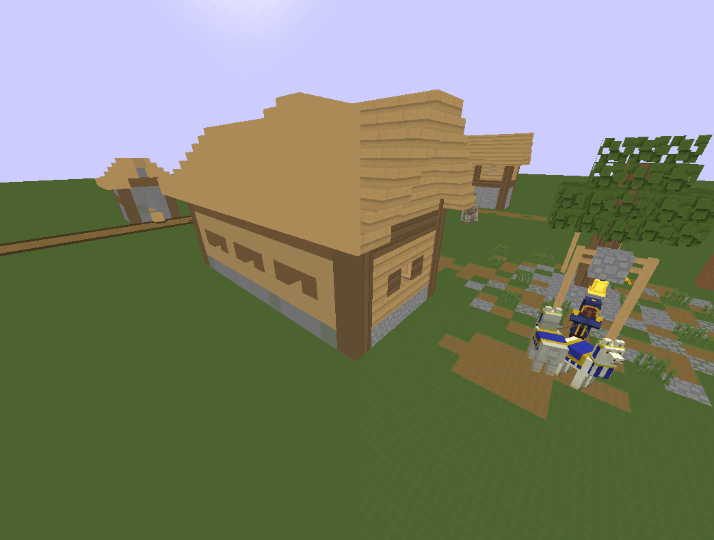

# VX-Simple
This is a simplified Minecraft GLSL shader which demonstrates how to implement voxelization and raytracing.

Upon researching this subject I found very few resources, so I'm uploading this in hopes that this may help someone in the future.

# Screenshot

Tested with Iris!
